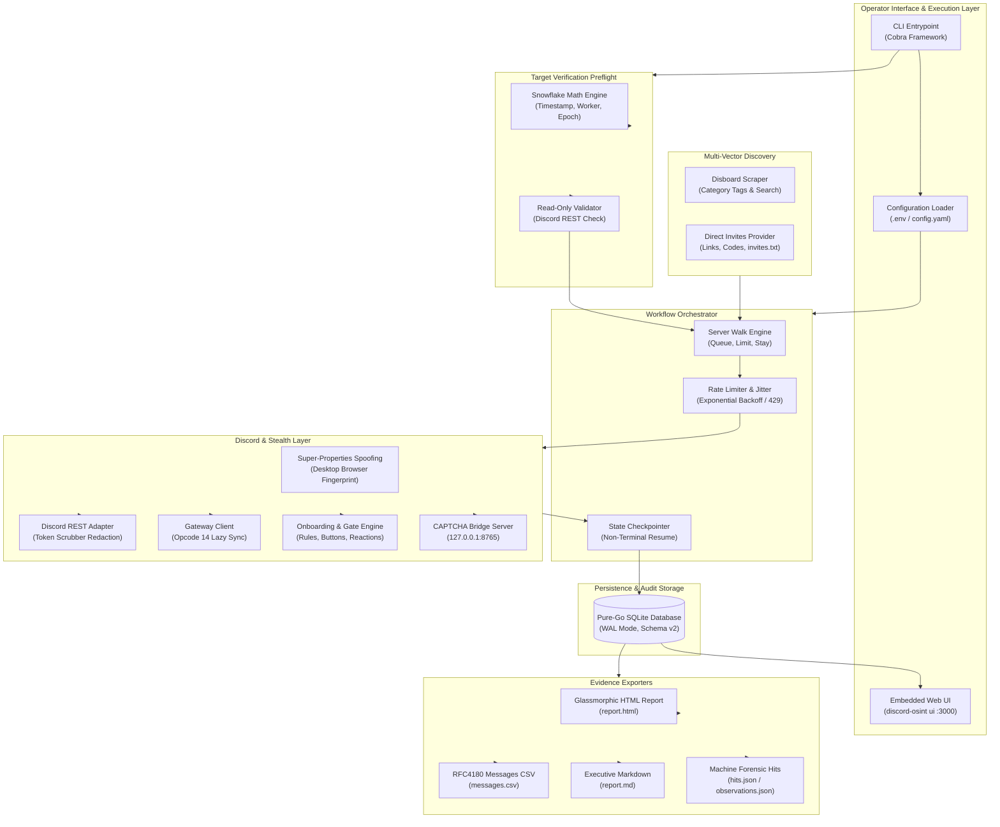
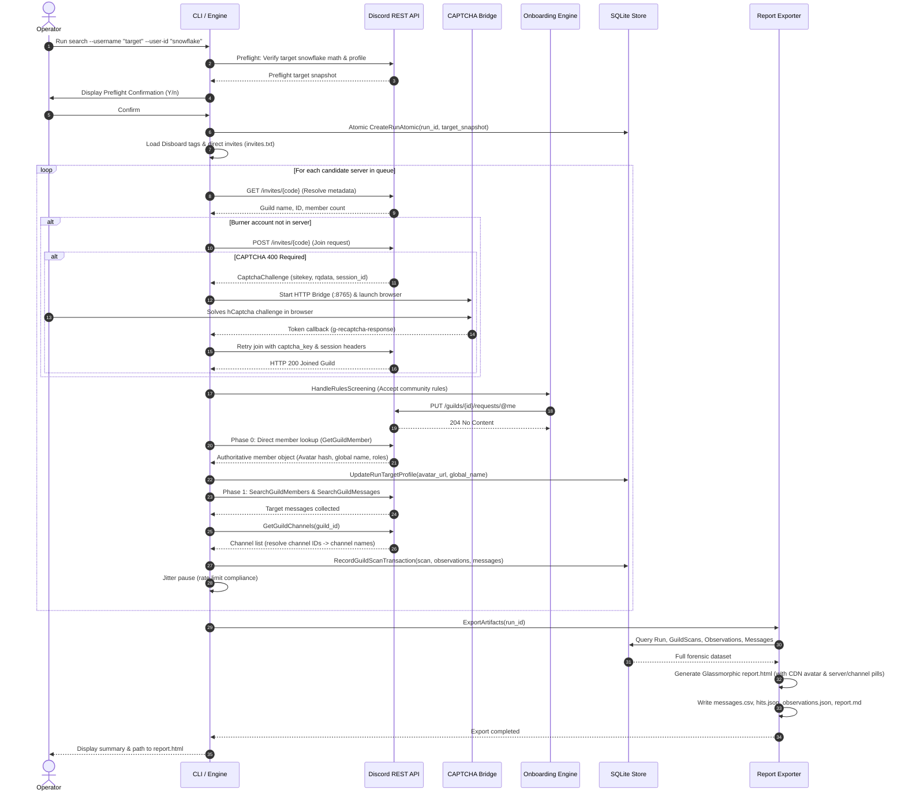
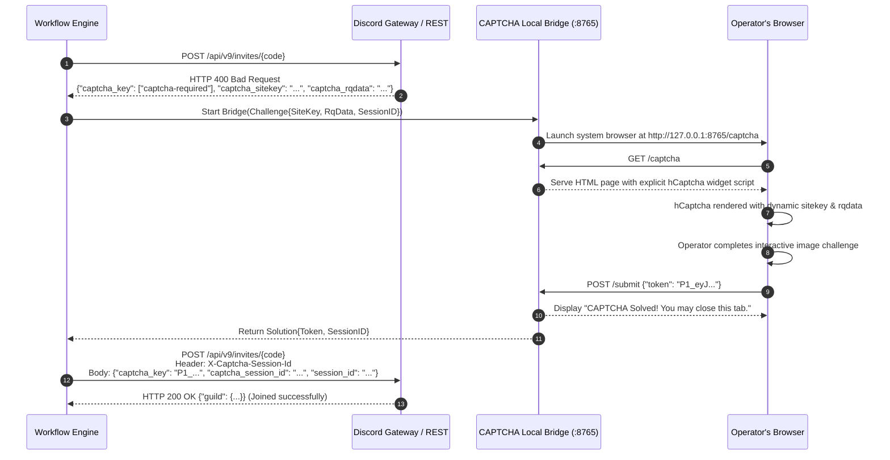
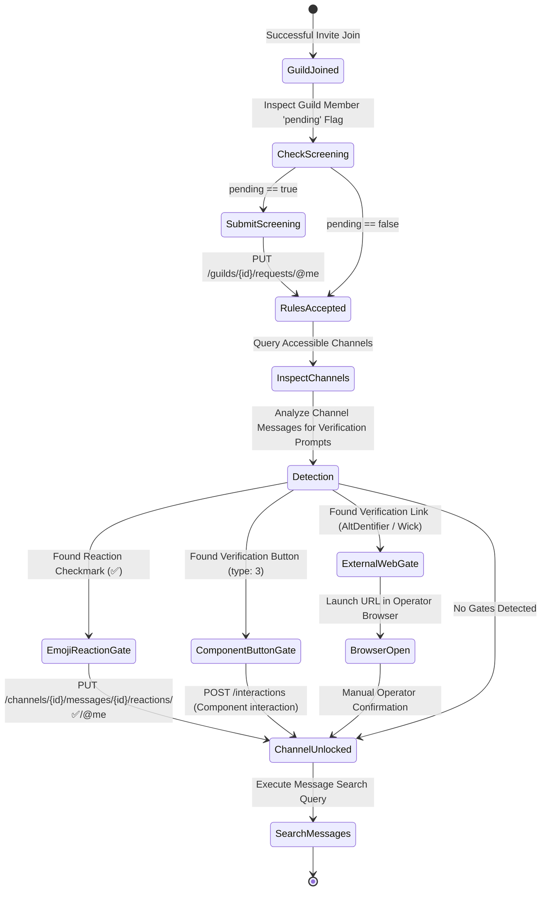
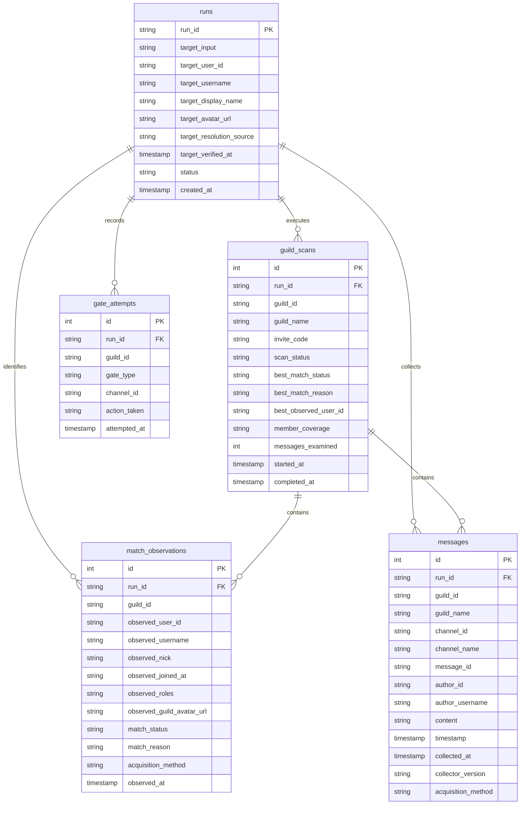

# Discord OSINT Investigation Platform

[](https://golang.org)
[](https://opensource.org/licenses/MIT)
[](https://modernc.org/sqlite)
[](https://discord.com)

A hardened, production-grade Discord OSINT (Open Source Intelligence) reconnaissance and forensic investigation platform written in Go. Built for cyber threat intelligence (CTI) analysts, incident responders, fraud investigators, and authorized operators to deterministically verify target presence, capture real CDN user avatars, map guild role structures, and harvest verifiable message evidence across public and gated Discord servers.

---

## Table of Contents

1. [Key Capabilities](#key-capabilities)
2. [System Architecture](#system-architecture)
3. [End-to-End Investigation Lifecycle](#end-to-end-investigation-lifecycle)
4. [Two-Tier Member & Message Discovery](#two-tier-member--message-discovery)
5. [Interactive CAPTCHA Bridge Architecture](#interactive-captcha-bridge-architecture)
6. [Onboarding & Channel Gate State Machine](#onboarding--channel-gate-state-machine)
7. [Database Schema & Provenance Model](#database-schema--provenance-model)
8. [Installation & Build](#installation--build)
9. [Configuration](#configuration)
10. [CLI Command Reference](#cli-command-reference)
11. [Forensic Artifacts & Glassmorphic Reporting](#forensic-artifacts--glassmorphic-reporting)
12. [Operational Security & Stealth Best Practices](#operational-security--stealth-best-practices)
13. [Troubleshooting & Error Matrix](#troubleshooting--error-matrix)

---

## Key Capabilities

- **Deterministic Snowflake Math & Target Preflight**:
  - Extracts millisecond-precision UTC account creation timestamp and Discord worker/process IDs from 64-bit Snowflake User IDs using bitwise arithmetic.
  - Zero-touch, read-only preflight verification validating username and snowflake consistency prior to creating database entries or network walks.
- **Dynamic Real Avatar CDN Resolution**:
  - Performs direct guild member queries upon joining to obtain authoritative Discord user profiles, global display names, and high-resolution avatar CDN hashes (`https://cdn.discordapp.com/avatars/{id}/{hash}.png?size=256`).
- **Human-Readable Channel & Server Mapping**:
  - Automatically queries Discord's channel hierarchy (`GetGuildChannels`) to resolve raw Snowflake IDs into real channel names (e.g. `#🌸・chat`, `#request-channel`, `#・ᰔ┊dm-and-fr-requests`) and pairs them with official server titles across all HTML, CSV, and Markdown exports.
- **Two-Tier Member Discovery & Full Author Probe**:
  - Combines REST targeted member queries (`/guilds/{id}/members/search`) with guild-wide author message search (`/guilds/{id}/messages/search?include_nsfw=true`) to discover users even in silent, unindexed, or massive servers.
- **Interactive CAPTCHA & Cloudflare Bridge**:
  - Detects hCaptcha / Cloudflare Turnstile challenges on guild join requests, spinning up an embedded local HTTP server (`http://127.0.0.1:8765/captcha`) and automatically orchestrating browser-based human-in-the-loop solving with session binding.
- **Onboarding Gate & Screening Automation**:
  - Automatically acknowledges Discord Community membership screening rules and supports button interaction (`type: 3`) and emoji reaction (`PUT /reactions/@me`) bypasses.
- **Discord-Styled Glassmorphic Reporting**:
  - Generates self-contained, standalone offline HTML investigation reports featuring Discord dark styling, frosted glass panels (`backdrop-filter: blur(20px)`), user profile hero cards, glowing KPI statistics, and authentic chat streams.

---

## System Architecture

The platform is designed around modular, decoupled components with strict identity separation between the investigator's burner session and the target footprint.



---

## End-to-End Investigation Lifecycle

The sequence diagram below traces the execution path from initial target verification to evidence finalization.



---

## Two-Tier Member & Message Discovery

To guarantee high coverage while minimizing API footprint, the engine executes a multi-tiered discovery pipeline:

```mermaid
flowchart TD
    START([Begin Guild Inspection]) --> P0[Tier 0: Direct Member Query<br/>GET /guilds/{id}/members/{target_id}]
    
    P0 -->|HTTP 200 Found| CONFIRM0[Confirm Presence: user_id_exact]
    CONFIRM0 --> AVATAR[Extract Real Discord Avatar CDN Hash<br/>and Guild Nickname / Roles]
    AVATAR --> DB_PROF[Update Run Target Profile in SQLite]
    
    P0 -->|HTTP 404 / 403| P1[Tier 1: Targeted REST Query<br/>GET /guilds/{id}/members/search?query=...]
    
    P1 -->|Matched User ID| CONFIRM1[Confirm Presence: user_id_exact]
    P1 -->|Matched Username Only| CAND1[Record Candidate: username_exact]
    P1 -->|Fuzzy Nickname Match >= 0.85| CAND2[Record Candidate: nickname_similar]
    P1 -->|No Member Hit| P2[Tier 2: Guild-Wide Message Probe<br/>GET /guilds/{id}/messages/search?author_id=...]
    
    DB_PROF --> P2
    CONFIRM1 --> P2
    CAND1 --> P2
    CAND2 --> P2
    
    P2 -->|Target Author Hit| CONFIRM2[Confirm Presence: message_author_id_exact]
    CONFIRM2 --> CH_RESOLV[Query GetGuildChannels<br/>Resolve Channel IDs to Names]
    CH_RESOLV --> MSGS_CSV[Append to Messages Collection<br/>with Guild & Channel Names]
    
    P2 -->|0 Messages Returned| COVERAGE[Evaluate Member Coverage<br/>complete vs partial]
    MSGS_CSV --> SAVE[Commit Transaction to Database]
    COVERAGE --> SAVE
    SAVE --> DONE([Inspection Finished])
```

---

## Interactive CAPTCHA Bridge Architecture

When Discord requires a CAPTCHA verification challenge during a guild join request, the engine routes the challenge through a local web bridge:



---

## Onboarding & Channel Gate State Machine

Discord servers often guard channels behind membership rules screening, verification bots, or role reaction gates. The state machine navigates these gates autonomously:



---

## Database Schema & Provenance Model

The platform utilizes a pure-Go SQLite driver (`modernc.org/sqlite`) configured in WAL (Write-Ahead Logging) mode with schema v2 migrations and strict relational integrity constraints:



---

## Installation & Build

### Prerequisites

- **Go**: Version 1.22 or higher.
- **Git**: For version control operations.
- **Operating System**: macOS (Apple Silicon / Intel), Linux, or Windows.

### Build from Source

```bash
# Clone the private repository
git clone https://github.com/Kingof3O/discord-osint.git
cd discord-osint

# Compile self-contained static binary (No CGO required)
CGO_ENABLED=0 go build -o bin/discord-osint ./cmd/discord-osint

# Verify executable build
./bin/discord-osint --help
```

---

## Configuration

Configure environment variables via `.env` or YAML configuration (`config.yaml`):

```bash
cp config.example.yaml config.yaml
```

### Environment Variables Matrix

| Variable | Type | Default | Description |
| :--- | :--- | :--- | :--- |
| `DISCORD_TOKEN` | `string` | *Required* | Burner Discord account user token |
| `DATABASE_PATH` | `string` | `run.sqlite` | Path to SQLite database |
| `PROXY` | `string` | `""` | Optional HTTP or SOCKS5 proxy URL (`socks5://127.0.0.1:9050`) |
| `MAX_JOINS_PER_HOUR` | `int` | `8` | Maximum guild joins allowed per 60-minute window |
| `JOIN_DELAY_SEC` | `string` | `30,90` | Min,Max random jitter interval in seconds between joins |
| `CAPTCHA` | `string` | `manual` | CAPTCHA mode (`manual` to open solver bridge, `skip` to bypass) |
| `CAPTCHA_BRIDGE_PORT`| `int` | `8765` | Local port for interactive solver bridge HTTP server |
| `AUTO_OPEN_BROWSER` | `bool` | `true` | Automatically launch default browser on CAPTCHA challenge |
| `LOG_LEVEL` | `string` | `info` | Logging verbosity (`debug`, `info`, `warn`, `error`) |

---

## CLI Command Reference

### 1. `search` &mdash; Run Multi-Server Investigation Walk

Execute an end-to-end OSINT search walk:

```bash
./bin/discord-osint search \
  --invites-file invites.txt \
  --username "target_user" \
  --user-id "1533658238715695116" \
  --stay \
  --yes
```

#### Flags:
- `--username`: Target Discord username or handle.
- `--user-id`: Target 64-bit Snowflake User ID (authoritative).
- `--invite`: Single invite code or full URL.
- `--invites-file`: Text file with line-separated Discord invite codes/URLs.
- `--server-name`: Target server names to search and prioritize via Disboard.
- `--stay`: Keep burner account in servers after discovering target.
- `--yes`: Auto-confirm target verification preflight prompt.
- `--limit`: Maximum number of servers to walk.

### 2. `export` &mdash; Re-Export Evidence & Reports

Re-generate all forensic artifacts for a historical run:

```bash
./bin/discord-osint export --run-id run_1789521895 -o exports_custom/
```

### 3. `ui` &mdash; Real-Time Investigation Dashboard

Launch the embedded web dashboard:

```bash
./bin/discord-osint ui --port 3000
```

Navigate to `http://127.0.0.1:3000` to inspect runs, live server scans, identity observations, and chat streams.

### 4. `history` &mdash; Display Audit Run History

List all historical investigation runs with confirmed and candidate match counts:

```bash
./bin/discord-osint history
```

### 5. `resume` &mdash; Smart Resume Interrupted Runs

Resume an interrupted or rate-limited scan without re-scanning completed servers:

```bash
# Auto-resumes the most recent incomplete run:
./bin/discord-osint resume

# Or resume a specific run ID:
./bin/discord-osint resume run_1789521895
```

### 6. `verify` &mdash; Read-Only Target Preflight

Perform a standalone target resolution preflight with zero database or file writes:

```bash
./bin/discord-osint verify --user-id "1533658238715695116" --username "target_user"
```

---

## Forensic Artifacts & Glassmorphic Reporting

Every run creates a dedicated export directory `exports_run_<timestamp>/` containing verifiable evidence files:

```
exports_run_1789521895/
├── report.html         # Standalone Glassmorphic visual report
├── report.md           # Executive markdown summary
├── messages.csv        # RFC4180 CSV with server & channel names
├── hits.json           # Machine-readable per-guild match findings
└── observations.json   # Member profile observations & role maps
```

### Visual HTML Report Elements

- **Discord Profile Hero Card**: Real avatar CDN image, verified badges, target handle `@username`, and Snowflake creation timestamps.
- **Scanned Server Audit**: Table detailing scan status, match reason, and member coverage bounds.
- **Identity Observations**: Server nicknames, guild join dates, and assigned role IDs.
- **Authentic Chat Stream**:
  - Author avatar & handle.
  - Server pill: `<span class="msg-server-pill">🏛️ Cornhub</span>`
  - Channel pill: `<span class="msg-chan-pill">#🌸・chat</span>`
  - Message timestamp and escaped raw message content.

---

## Operational Security & Stealth Best Practices

1. **Burner Isolation**: Always use disposable burner Discord accounts. Never use personal or corporate accounts.
2. **Proxy Chaining**: Route requests through residential proxies or SOCKS5 endpoints via the `PROXY` setting.
3. **Jitter & Delays**: Maintain `MAX_JOINS_PER_HOUR` at or below 8 with randomized `JOIN_DELAY_SEC` (30-90s) to prevent automated anti-bot flagging.
4. **Token Scrubbing**: The embedded regex scrubber automatically sanitizes user tokens from terminal outputs, log entries, and database traces.

---

## Troubleshooting & Error Matrix

| Error Code / Symptom | Root Cause | Solution |
| :--- | :--- | :--- |
| `HTTP 401 Unauthorized` | Invalid or expired burner token | Update `DISCORD_TOKEN` in `.env` with a fresh token |
| `HTTP 403 Forbidden on /users` | User tokens cannot query arbitrary user endpoints | Handled automatically: Engine falls back to snowflake math and `GetGuildMember` |
| `HTTP 429 Too Many Requests` | Rate limit hit on Discord endpoint | Engine honors `Retry-After` header and pauses automatically |
| `CAPTCHA required` | Guild requires anti-bot join verification | Solve challenge in solver browser window or set `CAPTCHA=skip` |
| `invalid-input-response` | Captcha token expired before submission | Complete CAPTCHA challenge promptly when browser opens |

---

## License

This project is licensed under the MIT License. See [LICENSE](LICENSE) for details.
