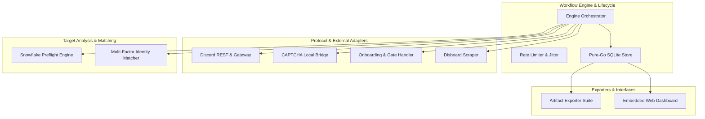
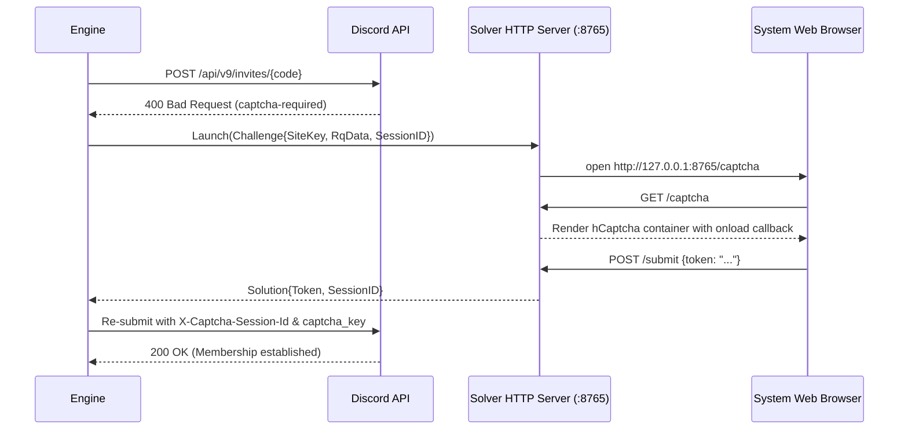
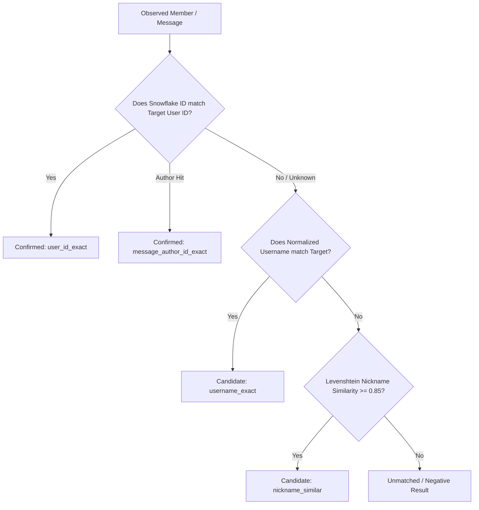

# Technical Architecture & Subsystem Specification

This document details the internal design, concurrency models, protocol adapters, anti-detection mechanisms, and relational data guarantees implemented across the **Discord OSINT Investigation Platform**.

---

## 1. High-Level Subsystem Topology

---

## 2. Subsystem Breakdown

### 2.1 `internal/target` &mdash; Preflight Verification & Snowflake Math

- **Snowflake Arithmetic**: Discord Snowflake IDs are 64-bit unsigned integers. The upper 42 bits represent the timestamp offset from Discord's custom epoch (`2015-01-01T00:00:00.000Z` or `1420070400000` ms).
  $$\text{Timestamp (ms)} = (\text{Snowflake} \gg 22) + 1420070400000$$
  The internal worker ID (bits 17-21) and process ID (bits 12-16) are also extracted for forensic verification.
- **Read-Only Guarantee**: `verify.go` guarantees zero side-effects: no database queries, no disk writes, and no guild joins.
- **Safety Fallback**: Because Discord returns `HTTP 403 Forbidden` when user tokens attempt `GET /users/{id}` on arbitrary IDs, the preflight gracefully falls back to deterministic snowflake math and operator confirmation.

### 2.2 `internal/discord` &mdash; Hardened REST & Gateway Client

- **Browser Fingerprint Emulation**:
  Generates `X-Super-Properties` containing realistic desktop client metadata (OS, browser build, client version).
- **Token Redaction Filter**:
  A global `TokenScrubber` maintains a dictionary of active tokens and redacts them (`[REDACTED]`) from all error messages, HTTP logs, and console traces.
- **Member Discovery Tiers**:
  - **Tier 0**: Queries `GET /guilds/{id}/members/{target_id}` to retrieve authoritative avatar CDN hashes (`/avatars/{id}/{hash}.png`), server nicknames, and assigned role IDs.
  - **Tier 1**: Executes REST search queries (`GET /guilds/{id}/members/search?query={target}`) up to pagination bounds.
  - **Tier 2**: Executes guild-wide message search (`GET /guilds/{id}/messages/search?author_id={id}&include_nsfw=true`).
- **Channel Resolution**:
  Queries `GET /guilds/{id}/channels` to map channel Snowflake IDs to human-readable names (`#🌸・chat`, `#request-channel`).

### 2.3 `internal/captcha` &mdash; Interactive Solver Bridge

- **Session Continuity**: Discord ties challenges to `captcha_session_id` and Gateway `session_id`. The solver bridge preserves these across attempts.
- **Dual Input Modes**: Supports automated HTTP callback from browser or direct terminal manual copy-paste.

### 2.4 `internal/onboarding` &mdash; Gate & Screening Bypasses

1. **Membership Screening Rules**:
   Inspects `member.Pending`. If `true`, queries screening configuration and immediately submits `PUT /guilds/{guildID}/requests/@me` with `{ "form_fields": [...] }`.
2. **Channel Reactions**:
   Scans welcome/rules channels for verification prompts with checkmarks (`✅`), emulating `PUT /channels/{chanID}/messages/{msgID}/reactions/✅/@me`.
3. **Component Buttons**:
   Parses `components` on bot messages for `type: 3` (Button) interactions, submitting structured `POST /interactions` payloads.
4. **External Web Gates**:
   Detects AltDentifier, WickBot, DoubleCounter, and RestoreCord URLs, launching the link in the operator's browser and awaiting manual confirmation.

### 2.5 `internal/store` &mdash; SQLite Persistence & Concurrency

- **Engine**: Pure-Go SQLite (`modernc.org/sqlite`) &mdash; requires zero CGO, cross-compiles trivially across all platforms.
- **Concurrency**: Operates in **WAL (Write-Ahead Logging)** mode (`PRAGMA journal_mode = WAL`), enabling concurrent readers without blocking writes.
- **Relational Integrity**:
  - `CHECK (best_match_status != 'not_found' OR member_coverage = 'complete')`
  - Composite unique indexes on `(run_id, guild_id, observed_user_id, observed_username_norm, observed_nick)` prevent duplicate evidence.
- **Migrations**: `PRAGMA user_version` migrations ensure backward-compatible schema updates (v1 to v2 adds `guild_name` and `channel_name`).

---

## 3. Evidence Classification Hierarchy

The matcher (`internal/matcher`) categorizes observations into three deterministic tiers:

---

## 4. Operational Safety & Rate Limiter

- **Exponential Backoff**:
  When Discord returns `HTTP 429 Too Many Requests`, the client inspects `Retry-After` headers and pauses with randomized jitter.
- **Join Pacing**:
  Default bound: `MAX_JOINS_PER_HOUR=8` with random delays between 30 and 90 seconds.
